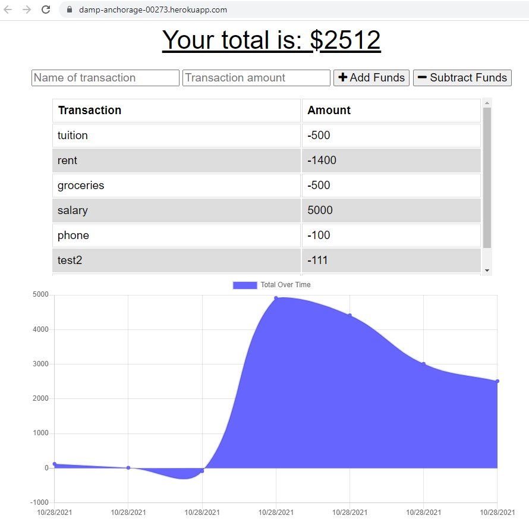

# Budget Tracker: Progressive Web Applications (PWA)

Giving users a fast and easy way to track their money is important, but allowing them to access that information at any time is even more important. Having offline functionality is paramount to the success of an application that handles users’ financial information.

Your challenge this week is to add functionality to an existing budget tracker application to allow for offline access and functionality. The user will be able to add expenses and deposits to their budget with or without a connection. When entering transactions offline, it should update the total when brought back online.

## Screenshot of the finished product

You can visit the live link [here](https://damp-anchorage-00273.herokuapp.com/)

